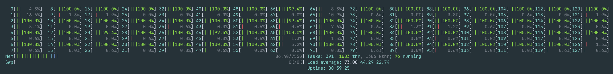

# rds-workload

RDS core workload.

## Object replicas

| Iterations / nodes / namespaces               | 1   | 120   |
| --------------------------------------------- | --- | ----- |
| configmaps                                    | 30  | 3600  |
| deployments_best_effort                       | 25  | 3000  |
| deployments_dpdk (CTP lab / R760)             | 15  | 1800  |
| deployments_dpdk (scalelab / FC640)           | 7   | 840   |
| endpoints (25 x service)                      | 500 | 60000 |
| networkPolicy                                 | 3   | 360   |
| namespaces                                    | 1   | 120   |
| pods_best_effort (2 x deployment)             | 50  | 6000  |
| pods_dpdk (1 x deployment) (cpt LAB / R760)   | 15  | 1800  |
| pods_dpdk (1 x deployment) (scalelab / FC640) | 7   | 840   |
| route                                         | 2   | 240   |
| services                                      | 20  | 2400  |
| secrets                                       | 42  | 5040  |

## Design principles

 - A workload that resembles Webscale in terms of number of resources and topology (pod to svc ratio, svc to endpoint, etc.)
 - A mix of best effort and guaranteed QoS pods (dpdk pods) (one entire NUMA node for guaranted QoS dpdk pods)
 - E-W data traffic in the form of liveness probes
 - LB type services provided by MetalLB for ingress traffic, with 50% of the namespaces having services of type LoadBalancer (will also try to make this ratio configurable)
 - Consolidate on a single workload more akin to cluster-density than to node-density, and leverage it both for control plane and worker node stressing if needed
 - A canned workload that could be reused among QE and perf/scale testing, able to run in small scales (even a local ovn-k8s kind.sh cluster if needed for CI purposes) and adjustable in size, number of cores per dpdk pods, etc.
 - Don't redo what multi-bench is doing, as we ideally have one tool for kernel networking performance measurment.

## DPDK pods

DPDK QoS guaranteed pods are emulated using stress-ng consuming 100% CPU on each core.

Each DPDK pod has:
 - 4 cores
 - 1 GB memory
 - 1 GB hugepage
 - 1 OVN interface
 - 2 SRIOV interfaces

The ideia is that they consume an entire NUMA node. I.e.: In this example NUMA node0 CPUs are even numbers and cores 0 and 64 are reserved:
     

## Input parameters

 - General
   - BURST
   - CHURN
   - CHURN_CYCLES
   - CHURN_DELAY
   - CHURN_DELETION_STRATEGY
   - CHURN_DURATION
   - CHURN_PERCENT
   - ES_SERVER
   - GC_METRICS
   - GC
   - JOB_ITERATIONS
   - LOCAL_INDEXING
   - POD_READY_THRESHOLD
   - QPS
   - SVC_LATENCY

 - Specific to the workload
   - INGRESS_DOMAIN: For E-W traffic
   - DPDK_PODS: Number of 4-core dpdk pods (should fill all the isolated cores of one NUMA node)